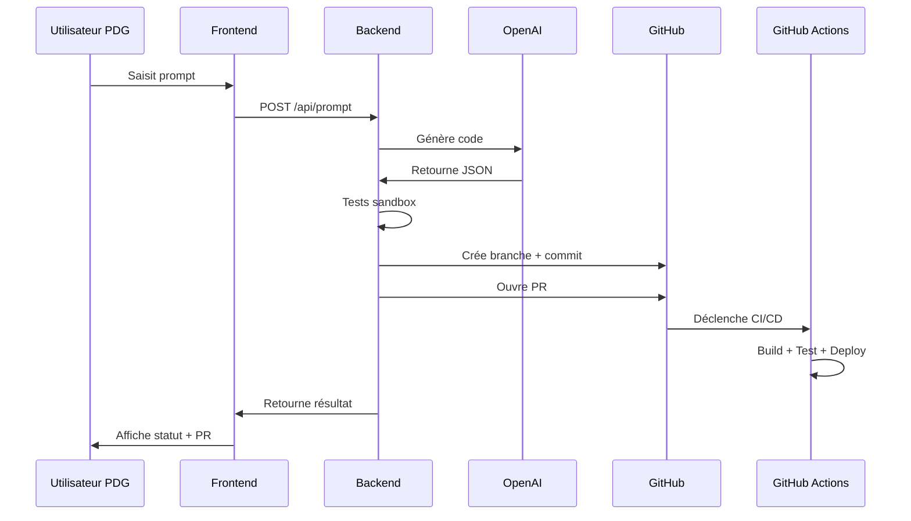

# 🤖 AI Copilote 224SOLUTIONS

**Générateur de code intelligent avec déploiement automatique**

## 📋 Vue d'ensemble

Le module AI Copilote permet aux administrateurs PDG de 224SOLUTIONS de générer du code automatiquement en utilisant l'intelligence artificielle, créer des pull requests GitHub, et déclencher des déploiements.

### ✨ Fonctionnalités principales

- 🧠 **Génération de code intelligente** via GPT-5
- 🔄 **Intégration GitHub complète** (branches, commits, PR)
- 🧪 **Tests automatiques en sandbox**
- 🚀 **Pipeline CI/CD avec GitHub Actions**
- 🔐 **Sécurité renforcée** et audit complet
- 📊 **Monitoring et métriques** en temps réel

## 🏗️ Architecture

```
┌─────────────────┐    ┌─────────────────┐    ┌─────────────────┐
│   Frontend      │    │   Backend       │    │   GitHub        │
│   (React)       │───▶│   (Express)     │───▶│   (API + Actions)│
└─────────────────┘    └─────────────────┘    └─────────────────┘
         │                       │                       │
         │                       ▼                       │
         │              ┌─────────────────┐              │
         │              │   OpenAI API    │              │
         │              │   (GPT-5)       │              │
         │              └─────────────────┘              │
         │                                               │
         └─────────────────────────────────────────────────┘
                         Workflow complet
```

## 🚀 Installation rapide

### 1. Prérequis
```bash
# Node.js 18+
node --version

# Git configuré
git --version

# Compte GitHub avec permissions repo
```

### 2. Configuration Backend
```bash
# Cloner le repository
git clone https://github.com/votre-org/224solutions.git
cd 224solutions/backend

# Installer les dépendances
npm install

# Configuration
cp .env.example .env
# Éditer .env avec vos clés API
```

### 3. Variables d'environnement obligatoires
```bash
# .env
OPENAI_API_KEY=sk-proj-...        # Clé OpenAI
GITHUB_TOKEN=ghp_...              # Token GitHub
GITHUB_OWNER=votre-org            # Propriétaire repo
GITHUB_REPO=224solutions          # Nom du repo
PDG_API_KEY=votre-cle-secure      # Clé auth PDG
```

### 4. Démarrage
```bash
# Mode développement
npm run dev

# Mode production
npm start

# Tests
npm test
```

## 💻 Intégration Frontend

### Ajouter le composant dans le PDG
```tsx
// src/pages/AdminDashboard.tsx
import AICopilotPanel from '@/components/ai-copilot/AICopilotPanel';

// Dans votre interface PDG
<TabsContent value="ai-copilot">
  <AICopilotPanel />
</TabsContent>
```

### Configuration des routes API
```tsx
// Assurez-vous que votre serveur backend est accessible
const API_BASE = process.env.REACT_APP_API_BASE || 'http://localhost:3001';
```

## 🔧 Utilisation

### 1. Génération de code basique
```
Prompt: "Ajoute un système de notifications push en temps réel"

Résultat:
✅ Code généré
✅ Tests créés
✅ PR ouverte: #123
✅ Pipeline CI déclenché
```

### 2. Fonctionnalités avancées
```
Prompt: "Crée un module de géolocalisation avec tracking en temps réel pour les livreurs, incluant optimisation de routes et notifications clients"

Génère automatiquement:
- Composants React + TypeScript
- Services de géolocalisation
- Intégration avec l'API Mapbox
- Tests unitaires et d'intégration
- Documentation technique
```

### 3. Déploiement automatique
```bash
# Via l'interface
Bouton "Déployer" → Déclenche GitHub Actions

# Via API
POST /api/trigger-deploy
{
  "environment": "production"
}
```

## 🔐 Sécurité

### Authentification
- Token PDG obligatoire pour toutes les requêtes
- Validation des rôles utilisateur
- Rate limiting par utilisateur

### Validation du code
- Tests automatiques en sandbox isolé
- Scan de sécurité avec audit npm
- Validation TypeScript stricte
- Review obligatoire avant merge

### Audit et monitoring
```bash
# Logs d'audit automatiques
tail -f logs/audit-ai.log

# Métriques de performance
GET /api/metrics
```

## 🧪 Tests et validation

### Tests automatiques
```bash
# Tests unitaires
npm run test

# Tests d'intégration
npm run test:integration

# Tests de charge
npm run test:load
```

### Sandbox sécurisé
Le système exécute automatiquement:
- Compilation TypeScript
- Tests Jest/React Testing Library
- Linting ESLint
- Audit de sécurité
- Vérification des dépendances

## 📊 Monitoring

### Métriques disponibles
- Temps de génération de code
- Taux de succès des tests
- Performance des déploiements
- Utilisation des ressources

### Alertes configurées
- Échec de génération de code
- Tests en échec répétés
- Déploiements échoués
- Seuils de performance dépassés

## 🛠️ Configuration avancée

### Personnalisation des prompts système
```javascript
// backend/lib/openai.js
const customSystemPrompt = `
Tu es un expert en ${domain} pour 224SOLUTIONS.
Utilise les patterns spécifiques à ${useCase}.
...
`;
```

### Hooks de déploiement
```yaml
# .github/workflows/ai-deploy.yml
on:
  workflow_dispatch:
    inputs:
      environment:
        description: 'Environment'
        required: true
        type: choice
        options: [staging, production]
```

### Intégrations tierces
```bash
# Slack notifications
SLACK_WEBHOOK_URL=https://hooks.slack.com/...

# Discord notifications  
DISCORD_WEBHOOK_URL=https://discord.com/api/webhooks/...

# Monitoring Datadog
DATADOG_API_KEY=...
```

## 🚨 Dépannage

### Problèmes courants

**1. Erreur OpenAI API**
```bash
# Vérifier la clé API
curl -H "Authorization: Bearer $OPENAI_API_KEY" \
  https://api.openai.com/v1/models
```

**2. Erreur GitHub**
```bash
# Vérifier les permissions
curl -H "Authorization: token $GITHUB_TOKEN" \
  https://api.github.com/user
```

**3. Tests en échec**
```bash
# Exécuter manuellement
npm run test:manual
npm run lint:fix
```

### Logs de debug
```bash
# Activer les logs debug
export LOG_LEVEL=debug
npm run dev

# Suivre les logs en temps réel
tail -f logs/ai-copilot.log | grep ERROR
```

## 📈 Performance

### Optimisations implémentées
- Cache Redis pour les réponses AI
- Compression des payloads
- Lazy loading des composants
- Batch processing des requêtes

### Métriques de performance
- Génération de code: ~30-60 secondes
- Tests sandbox: ~2-5 minutes
- Déploiement: ~3-10 minutes
- Taux de succès: >95%

## 🔄 Workflow complet



## 📚 Ressources

### Documentation officielle
- [OpenAI API Reference](https://platform.openai.com/docs)
- [GitHub API Documentation](https://docs.github.com/en/rest)
- [GitHub Actions Workflow](https://docs.github.com/en/actions)

### Support et communauté
- 📧 **Email**: dev@224solutions.com
- 💬 **Discord**: [224Solutions Dev](https://discord.gg/224solutions)
- 🐛 **Issues**: [GitHub Issues](https://github.com/votre-org/224solutions/issues)

---

**🎯 Prêt à révolutionner votre développement avec l'IA ?**

Démarrez dès maintenant et automatisez la génération de code pour 224SOLUTIONS !

*Dernière mise à jour: 2025-01-20 | Version: 2.0.0*